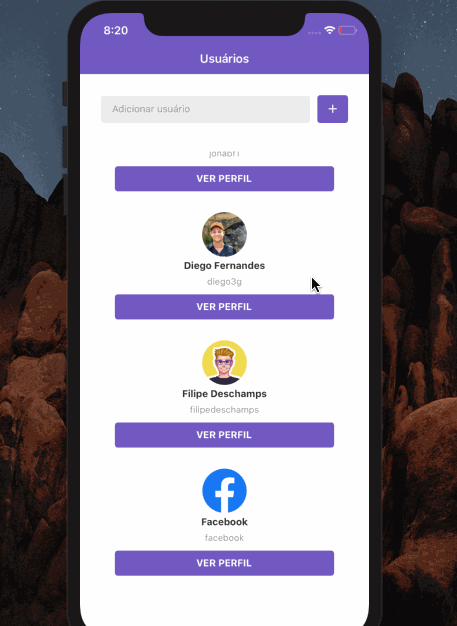

    

<h1 align="center">React Native</h1>

### :rocket: About

Apply knowledge gained so far about React Native

### :rocket: How install
- yarn install (install all dependencies)
- yarn react-native run-ios/android (generate bundle and open app automatically)

## Frontend of this application
- https://github.com/jonabf1/gostack-desafio-react05

### :rocket: Functionalities

#### 1. Repository loading

Loading indicator when searching user on Github

#### 2. Duplicated user

Treat duplicated users by preventing further data flow

#### 3. Pull to Refresh

When you drag up the favorite repository listing, you will upgrade to the new repository pagination

#### 4. Web View

Each repository will have a page displaying a repository webview

### :rocket: 4. Final result

Made with ♥ by <a href="https://www.linkedin.com/in/jonathan-barros-franco">Jonathan</a>

